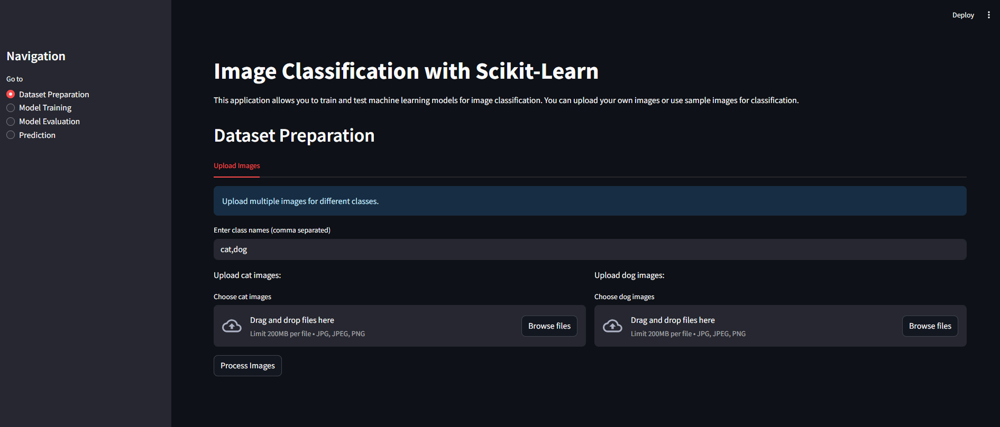

# Image Classification Project



A Streamlit-based web application for image classification using machine learning and deep learning techniques.

## Features

- Interactive web interface built with Streamlit
- Support for multiple machine learning models (SVM, Random Forest)
- Deep learning capabilities with TensorFlow
- Image preprocessing and visualization tools
- Model training and evaluation
- Confusion matrix visualization
- Sample image display

## Prerequisites

- Python 3.11.9
- pip (Python package installer)

## Installation

1. Clone the repository:
```bash
git clone <repository-url>
cd ImageClassifier
```

2. Create a virtual environment (recommended):
```bash
python -m venv venv
source venv/bin/activate  # On Windows: venv\Scripts\activate
```

3. Install dependencies:
```bash
pip install -r requirements.txt
```

## Project Structure

- `app.py` - Main Streamlit application
- `data_utils.py` - Data loading and preprocessing utilities
- `model_utils.py` - Model training and evaluation functions
- `training_utils.py` - Training pipeline utilities
- `visualization_utils.py` - Visualization helper functions

## Usage

1. Start the Streamlit application:
```bash
streamlit run app.py
```

2. Open your web browser and navigate to the URL shown in the terminal (typically http://localhost:8501)

3. Use the web interface to:
   - Upload and preprocess images
   - Train machine learning models
   - Evaluate model performance
   - Visualize results

## Features in Detail

### Data Preprocessing
- Image resizing and normalization
- Feature extraction
- Data splitting for training and testing

### Model Training
- Support Vector Machine (SVM)
- Random Forest Classifier
- TensorFlow-based deep learning models

### Visualization
- Sample image display
- Confusion matrix visualization
- Performance metrics display

## Contributing

Feel free to submit issues and enhancement requests.

## License

This project is licensed under the MIT License - see the LICENSE file for details.

## Acknowledgments

- Streamlit for the web interface framework
- Scikit-learn for machine learning algorithms
- TensorFlow for deep learning capabilities 